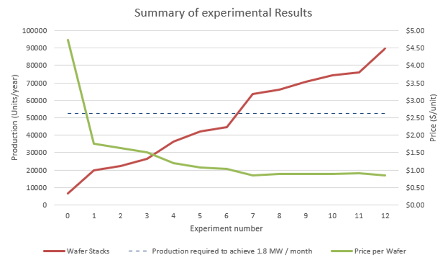

# ☀️ Simulation & Optimization of a Photovoltaic Production Facility

## 📌 Problem Statement

New World Energy (NWE) intends to establish a photovoltaic (PV) panel production facility in **Akureyri, Iceland**, targeting a production capacity of **1.8 Megawatts per month**. With the region’s abundant crystallized silicon deposits, access to renewable geothermal energy, and strong policy incentives, Akureyri presents a strategic location for this initiative.

This project utilizes **discrete event simulation and optimization techniques** to address key facility planning and investment decisions posed by NWE’s Chief Technology Officer (role played by the course instructor).

---

## 🎯 Project Objectives

This project aims to:

1. Develop a simulation-based production planning model.
2. Estimate capital investment requirements for both pilot and full-scale facilities.
3. Evaluate the feasibility of scaling operations with a **$500,000/month** budget over 12 months.
4. Define staffing requirements for pilot and expansion phases.
5. Determine the minimum sales price per PV wafer to achieve a **20% rate of return (ROR)**.

---

## 🔍 Methodology Overview

The simulation modeling lifecycle was followed to guide project development. Key phases included:

### 📂 1. Problem Formulation
- Defined the system scope and deliverables.
- Outlined key questions posed by NWE’s CTO.

### 🗂️ 2. Project Planning
- Developed a **Gantt chart** to plan and track the 79-day project timeline (Shown in **Figure 1** of the final report).

### 🔄 3. System Definition
- Created:
  - A process flow diagram of the manufacturing system (Shown in **Figure 2** of the final report).
  - A deterministic Excel-based cost and layout estimate.

### 🧠 4. Conceptual Modeling
- Formulated simulation logic and key assumptions.

### 📊 5. Preliminary Experimental Design
- Identified system variables and performance metrics.
- Designed simulation experiments to answer planning questions.

### 📥 6. Input Data Preparation
- Gathered machine processing times, staffing needs, and other data in collaboration with course instructor.

### ⚙️ 7–9. Model Development
- **Model Translation**: Implemented the logic in **Witness simulation software** (Shown in **Figures 7-10** of the final report).
- **Model Verification**: Ensured logical correctness.
- **Model Validation**: Collaborated with the course instructor to verify model accuracy.

### 📈 10–12. Experimentation & Analysis
- Simulated monthly production ramp-up.
- Analyzed bottlenecks, resource allocation, and performance trends.

### ✅ 13. Implementation
- Provided actionable insights.
- Addressed all strategic questions posed by the CTO.

---

## 🛠️ Technologies & Tools

- **Witness Simulation Software**
- **Microsoft Excel** (deterministic modeling & cost estimation)
- **Windows Laptop** (16 GB RAM, 12th Gen Intel Core i7 @ 1.7 GHz)

---

## 📊 Key Results

### 💵 Capital Requirements

| Facility Type                       | Total Investment |
|------------------------------------|------------------|
| Pilot Facility                     | $5.65M           |
| Full Capacity Facility (by Month 7)| $9.1M           |

> 📌 The $500,000/month budget is **sufficient** to reach the target production capacity of **1.8 MW/month by Month 7**, with an additional investment of **$3.45M** as shown in the project’s cost estimation spreadsheet.

---

### 👥 Staffing Requirements

#### Pilot Facility
One operator required in each area:

- Ore Cleaning  
- Crucible Preparation  
- Furnace Operation  
- Brick Production  
- Brick Inspection  
- Wire Sawing  
- Wafer Handling  

#### Expansion Phase
Staffing levels and shift patterns for each of the 12 months are detailed in **Tables 9–15** of the final report.

---

### 💲 Pricing Analysis

- To ensure a **minimum 20% return on investment**, sales price targets were calculated.
- At a unit wafer price of **$0.84**, the projected **12-month return** is **121.47%**.
- Monthly pricing targets are shown in figure below.

---

## 📚 References

- Internal communications with NWE leadership (instructor guidance).
- Industry benchmarks for photovoltaic manufacturing.
- Simulation best practices (course content from **IE 5322 – Simulation and Optimization**).

---

## Important Notice

The code in this repository is proprietary and protected by copyright law. Unauthorized copying, distribution, or use of this code is strictly prohibited. By accessing this repository, you agree to the following terms:

- **Do Not Copy:** You are not permitted to copy any part of this code for any purpose.
- **Do Not Distribute:** You are not permitted to distribute this code, in whole or in part, to any third party.
- **Do Not Use:** You are not permitted to use this code, in whole or in part, for any purpose without explicit permission from the owner.

Any violation of these terms will be subject to legal action. If you have any questions or require permission, please contact the repository owner.

Thank you for your cooperation.
